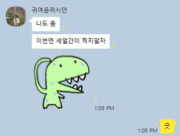
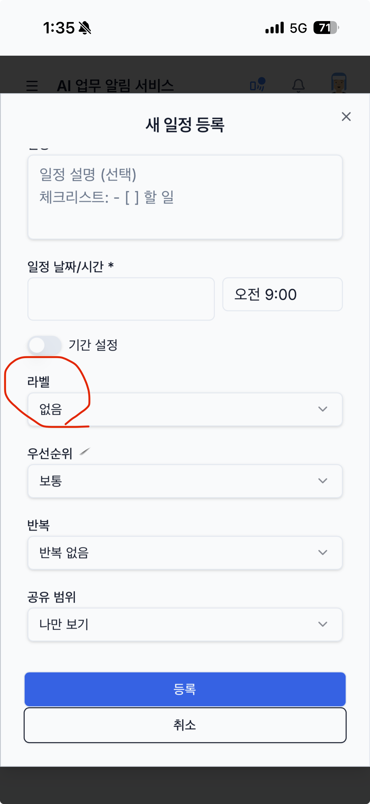
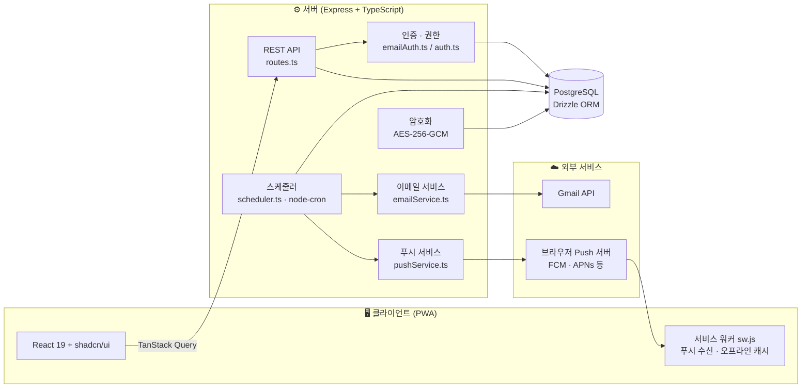
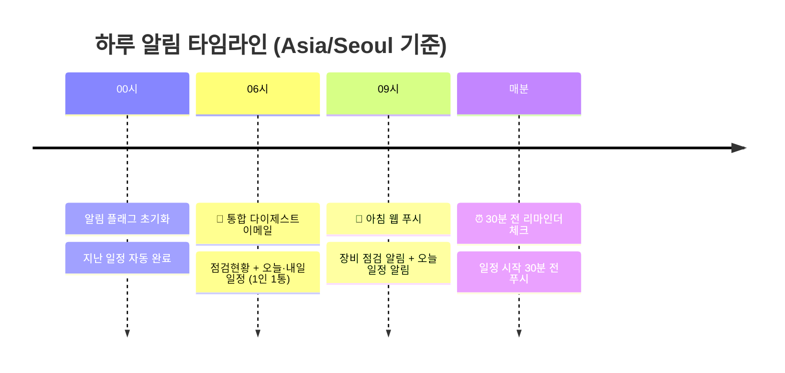
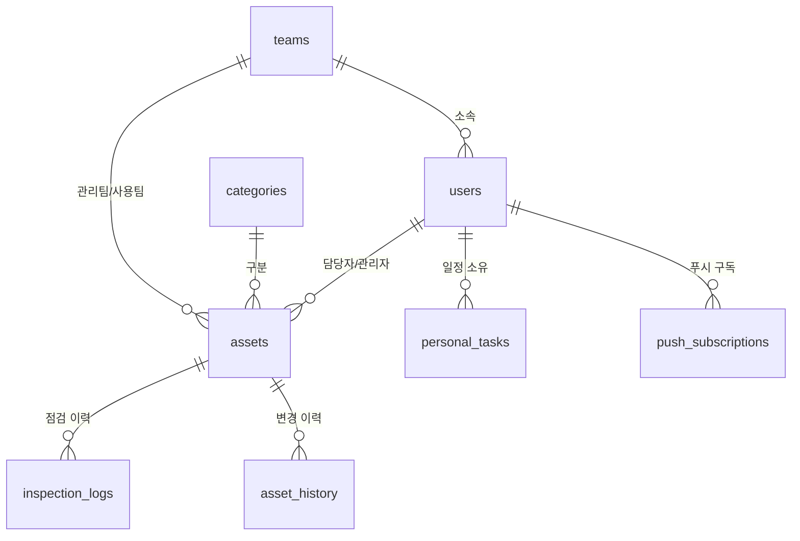

# 🔔 AI 업무 알림 서비스 (noti.kpetro)

> **장비 점검 이력 관리 + 자동 알림(이메일·웹 푸시) + 개인 일정 공유**를 하나로 통합한 풀스택 업무 알림 플랫폼


**🌐 운영 도메인**: `noti.kpetro.or.kr` · **배포**: Replit Reserved VM (24시간 상시 실행)

---

## 📌 이 프로젝트는 무엇인가요?

조직에서 관리하는 **장비·자산의 정기 점검을 놓치지 않도록** 도와주는 시스템입니다.

점검 주기가 다가오거나 지연된 장비가 있으면 **매일 아침 담당자에게 자동으로 이메일과 웹 푸시 알림**을 보내고, 팀원 간 **일정 공유**와 **30분 전 리마인더**까지 지원합니다. 별도 앱 설치 없이 **PWA(Progressive Web App)** 로 스마트폰 홈 화면에 설치해 네이티브 앱처럼 사용할 수 있습니다.

### 해결하는 문제

| Before 😰 | After 😊 |
|---|---|
| 점검 일정을 엑셀·수기로 관리하다 누락 | 시스템이 점검 주기를 자동 계산·추적 |
| 담당자가 바뀌면 인수인계 누락 | 담당자·관리자·팀장에게 자동 알림 |
| 점검했는지 안 했는지 확인 불가 | 점검 이력·변경 이력 전체 자동 기록 |
| 팀 일정을 구두·메신저로 공유 | 일정 공유 + 아침 푸시 + 30분 전 리마인더 |

---

## ✨ 주요 기능

### 1️⃣ 장비(자산) 점검 관리
- 장비 등록 시 **점검 주기(일 단위)** 지정 → 다음 점검일 자동 계산 (주말이면 다음 월요일로 자동 조정)
- 점검 상태 3단계 자동 분류: 🟢 **정상(ok)** / 🟡 **점검예정(upcoming, 7일 이내)** / 🔴 **점검지연(overdue)**
  - 상태는 DB 저장값이 아닌 **조회 시점에 실시간 재계산** → 항상 정확
- 개별 점검 / **일괄 점검(batch-inspect)** 처리, 점검 중단(suspend)·재개(resume)
- **엑셀 일괄 가져오기/내보내기** — 시리얼번호 기준 **Upsert**(있으면 수정, 없으면 신규 등록)

### 2️⃣ 자동 알림 시스템 (핵심 ⭐)
- **매일 오전 6시(KST)**: 통합 다이제스트 **이메일** 발송 — Gmail API, **1인 1통**
  - 📋 담당 장비 점검 현황 + 📅 오늘 일정 + 📅 내일 일정 (3개 섹션)
  - 보낼 내용이 하나도 없으면 발송하지 않음 (스팸 방지)
- **매일 오전 9시(KST)**: **웹 푸시** 발송 — 장비 점검 알림 + 오늘 일정 알림
- **매분 체크**: 일정 시작 **30분 전 리마인더 푸시** (등록자 + 공유 대상 전원)
- **매일 자정**: 알림 플래그 초기화 + 지난 일정 자동 완료 처리

### 3️⃣ 개인 일정 관리 ("내 일정")
- 일정 생성·수정·삭제·완료 토글, 캘린더 뷰 지원
- **공유 범위 설정**: 🔒 나만 보기(private) / 👥 특정 팀·사용자 선택(selected)
- 기간 일정(시작일~종료일), 반복 일정, 우선순위(0~3), 라벨 지원
- 공유받은 사람도 동일하게 아침 푸시 + 30분 전 리마인더 수신

### 4️⃣ 역할 기반 접근 제어 (RBAC)
- 3단계 역할 + 직책(팀장) 개념으로 **화면(UI)과 API 양쪽에서 이중 권한 검증**

### 5️⃣ PWA 웹 푸시
- VAPID 기반 Web Push 표준 프로토콜 (`web-push`)
- 홈 화면 설치 지원 (Android · **iOS 16.4+ Safari** · 삼성 인터넷)
- 서비스 워커 Network-First 캐싱 전략 + 오프라인 폴백 페이지
- 만료된 푸시 구독(HTTP 410/404) 자동 정리

### 6️⃣ 보안 · 이력 관리
- 이메일/비밀번호 인증 (bcrypt 해싱) + PostgreSQL 세션 스토어
- 사용자 이름 **AES-256-GCM 암호화** 저장 (서버 시작 시 자동 마이그레이션)
- 자산 변경 이력(`asset_history`) · 점검 이력(`inspection_logs`) 전체 감사 로그

---

## 🖼 스크린샷

| 대시보드 (데스크톱) | 내 일정 (모바일 PWA) |
|:---:|:---:|
|  |  |

---

## 🏗 시스템 아키텍처



---

## ⏰ 알림 시스템 동작 방식 (핵심 로직)

이 시스템의 심장은 `server/scheduler.ts` 입니다. 하루 동안 다음과 같이 동작합니다.



### 알림 수신 대상 결정 로직

장비 점검 알림은 아래 4가지 조건 중 하나라도 해당하면 수신합니다:

| 수신 대상 | 판별 기준 |
|---|---|
| 담당자 | `assets.staffId` 일치 |
| 장비관리자 | `assets.managerId` 일치 |
| 구분관리자 | `categories.managerIds[]` 배열에 포함 (복수 관리자 지원) |
| 팀장 | `position = '팀장'` 이면서 같은 팀 소속 |

### 안정성 설계 (운영에서 검증된 패턴 💪)

실제 운영하며 겪은 장애를 바탕으로 다음 안전장치가 코드에 녹아 있습니다:

- **멱등성 키**: `last_daily_digest_date` / `last_morning_push_date` 를 `system_settings` 테이블에 기록해 **하루 1회만 발송** 보장
- **발송 완료 후 기록 원칙**: 멱등성 키는 반드시 발송이 **성공한 뒤에만** 기록 → 발송 실패 시 다음 재시작에서 자동 재시도 (이메일이 1건이라도 실패하면 키를 기록하지 않음)
- **서버 재시작 Catch-up**: KST 06~23시 사이 서버가 재시작되면 5초 후 미발송분 자동 발송 (심야 재시작 시에는 스킵)
- **동시 실행 방지**: `isDailyDigestRunning` 플래그로 크론·catch-up 중복 실행 차단
- **DB 부하 절감**: 자산·사용자·일정 데이터를 **1회만 로딩해 이메일/푸시 로직이 공유** (`PreloadedData` 패턴)
- **발송 간격 제어**: 이메일 발송 사이 500ms 지연으로 Gmail API 속도 제한 회피
- **KST 타임존 유틸**: 서버 타임존과 무관하게 항상 한국 시간 기준으로 날짜 계산 (`getTodayKST`, `daysDiffKST` 등)

---

## 🛠 기술 스택

| 구분 | 기술 | 용도 |
|---|---|---|
| **프론트엔드** | React 19 + TypeScript | UI 라이브러리 |
| | Vite 7 | 빌드 도구 + 개발 서버 (HMR) |
| | shadcn/ui + Radix UI + Tailwind CSS 4 | UI 컴포넌트 · 스타일링 |
| | TanStack Query 5 | 서버 상태 관리 · API 캐싱 |
| | wouter | 경량 클라이언트 라우팅 |
| | React Hook Form + Zod | 폼 처리 · 스키마 검증 |
| | Recharts | 대시보드 차트 |
| **백엔드** | Express 4 + TypeScript | REST API 서버 |
| | Drizzle ORM + PostgreSQL | 타입 안전 DB 접근 |
| | node-cron | 알림 스케줄러 |
| | web-push | 웹 푸시 (VAPID) |
| | googleapis (Gmail API) | 다이제스트 이메일 발송 |
| | express-session + connect-pg-simple | 세션 관리 (PostgreSQL 스토어) |
| | bcryptjs | 비밀번호 해싱 |
| | multer + xlsx | 엑셀 업로드 · 파싱 · 생성 |
| **공통** | Zod + drizzle-zod | 프론트·백 공유 검증 스키마 |
| | date-fns | 날짜 계산 |
| **배포** | Replit Reserved VM | 24시간 상시 실행 |
| | esbuild | 서버 번들링 (cold start 최적화) |

---

## 📁 프로젝트 구조

```
noti.kpetro/
├── client/                     # 프론트엔드 (React)
│   ├── public/
│   │   ├── sw.js               # 서비스 워커 (푸시 수신 + 오프라인 캐시)
│   │   ├── manifest.json       # PWA 매니페스트
│   │   └── manual.html         # 사용자 매뉴얼 (웹 버전)
│   └── src/
│       ├── pages/              # 페이지 컴포넌트
│       │   ├── Dashboard.tsx   #  / 대시보드 (통계 + 차트)
│       │   ├── Assets.tsx      #  /assets 장비 관리
│       │   ├── MySchedule.tsx  #  /schedule 내 일정 (캘린더)
│       │   ├── Team.tsx        #  /team 팀 · 사용자 · 구분 관리
│       │   ├── Logs.tsx        #  /logs 점검 · 변경 이력
│       │   └── Settings.tsx    #  /settings 시스템 설정
│       ├── components/         # 공용 컴포넌트 (푸시 토글, 엑셀 가져오기 등)
│       ├── contexts/           # UserContext (현재 사용자 · 인증 상태)
│       └── lib/                # API 클라이언트, 권한 유틸, 타입
├── server/                     # 백엔드 (Express)
│   ├── index.ts                # 서버 엔트리 포인트
│   ├── routes.ts               # REST API 전체 라우트 (~50개 엔드포인트)
│   ├── scheduler.ts            # ⭐ 알림 스케줄러 (크론 4개 + catch-up)
│   ├── pushService.ts          # 웹 푸시 발송 (VAPID)
│   ├── emailService.ts         # Gmail API 이메일 발송
│   ├── emailAuth.ts            # 이메일/비밀번호 인증
│   ├── auth.ts                 # 역할 권한 검증 로직
│   ├── storage.ts              # DB 접근 계층 (Repository 패턴)
│   ├── excel.ts                # 엑셀 가져오기/내보내기/템플릿
│   ├── encryption.ts           # AES-256-GCM 암호화
│   └── encryptionMigration.ts  # 기존 데이터 자동 암호화 마이그레이션
├── shared/
│   └── schema.ts               # ⭐ DB 스키마 + Zod 검증 (프론트·백 공유)
├── db/                         # DB 커넥션 · 시드
├── docs/                       # 역할별 사용자 매뉴얼 (마크다운)
└── script/build.ts             # 프로덕션 빌드 스크립트
```

---

## 🗄 데이터베이스 스키마

PostgreSQL + Drizzle ORM, 총 **10개 테이블**. 모든 PK는 `gen_random_uuid()` 자동 생성.

| 테이블 | 설명 |
|---|---|
| `teams` | 조직 팀 (관리 팀 / 사용 팀 구분, 부서명 포함) |
| `categories` | 장비 구분 — `managerIds[]` 복수 관리자, 기본 점검주기 |
| `users` | 사용자 — 역할 · 직책 · 담당 구분, `username` AES-256-GCM 암호화 |
| `assets` | 장비 — 관리팀/사용팀 · 담당자/관리자 · 점검주기 · 다음점검일 · 상태 |
| `inspection_logs` | 점검 실행 이력 |
| `asset_history` | 자산 변경 감사 로그 (필드 단위 old/new 값 기록) |
| `personal_tasks` | 개인 일정 — 공유 범위 · 기간 · 반복 · 우선순위 · 알림 플래그 |
| `push_subscriptions` | 웹 푸시 구독 정보 (endpoint, p256dh, auth) |
| `system_settings` | key-value 설정 (멱등성 키, 암호화 마이그레이션 플래그 등) |
| `sessions` | express-session 세션 스토어 |



---

## 👥 역할 및 권한

| 역할 | 이름 | 주요 권한 |
|---|---|---|
| `admin` | 마스터 | 전체 기능 접근 (팀·사용자·구분·장비 전체 CRUD, 계정 생성·비밀번호 초기화) |
| `manager` | 구분 관리자 | 담당 구분의 장비 CRUD + 담당 직원 관리 |
| `staff` | 담당자 | 자신의 장비 등록·수정 + 점검 실행 |
| (직책) `팀장` | 팀장 | 같은 팀 전체 장비의 점검 현황 다이제스트 수신 |

> 권한은 클라이언트(UI 노출 제어)와 서버(API `requireAuth` 미들웨어) **양쪽에서 동일한 로직으로 이중 검증**됩니다.

---

## 🔌 주요 API 엔드포인트

약 50개 엔드포인트 중 핵심만 요약합니다. 전체는 [`server/routes.ts`](server/routes.ts) 참고.

| 경로 | 기능 |
|---|---|
| `GET/POST/PATCH/DELETE /api/assets` | 장비 CRUD |
| `POST /api/assets/:id/inspect` | 점검 실행 |
| `POST /api/assets/batch-inspect` | 일괄 점검 |
| `POST /api/assets/:id/suspend` · `/resume` | 점검 중단 · 재개 |
| `GET /api/assets/export` · `POST /api/assets/import` | 엑셀 내보내기 / 가져오기(Upsert) |
| `GET/POST/PATCH/DELETE /api/personal-tasks` | 개인 일정 CRUD |
| `POST /api/personal-tasks/:id/toggle` | 일정 완료 토글 |
| `POST /api/push/subscribe` · `DELETE /api/push/unsubscribe` | 푸시 구독 관리 |
| `GET /api/push/vapid-key` | VAPID 공개키 조회 |
| `POST /api/email/check-inspections` | 알림 수동 트리거 (관리자) |
| `GET /api/teams` · `/api/users` · `/api/categories` | 팀 · 사용자 · 구분 관리 |
| `GET /api/history` · `/api/logs` | 변경 · 점검 이력 조회 |
| `GET /api/health` | 헬스 체크 |

---

## 🚀 시작하기

### 1. 사전 준비
- Node.js 20+
- PostgreSQL 데이터베이스
- (이메일 발송 시) Gmail API 연동 — Replit 환경에서는 `google-mail` 커넥터 사용

### 2. 설치

```bash
git clone https://github.com/yonghwan86/noti.kpetro.git
cd noti.kpetro
npm install
```

### 3. 환경변수 설정

| 변수 | 필수 | 설명 |
|---|:---:|---|
| `DATABASE_URL` | ✅ | PostgreSQL 접속 문자열 |
| `SESSION_SECRET` | ✅ | 세션 암호화 시크릿 |
| `ENCRYPTION_KEY` | ✅ | 개인정보 AES-256-GCM 암호화 키 |
| `VAPID_PUBLIC_KEY` | ✅ | 웹 푸시 VAPID 공개키 |
| `VAPID_PRIVATE_KEY` | ✅ | 웹 푸시 VAPID 개인키 |
| `VAPID_SUBJECT` | ⬜ | VAPID subject (`mailto:` 형식) |
| `PORT` | ⬜ | 서버 포트 (기본값 있음) |

> 💡 VAPID 키 생성: `npx web-push generate-vapid-keys`

### 4. DB 스키마 반영 & 실행

```bash
npm run db:push      # Drizzle 스키마를 DB에 반영
npm run dev          # 개발 서버 (Vite HMR 포함)
```

### 5. 프로덕션 빌드 & 실행

```bash
npm run build        # 클라이언트(Vite) + 서버(esbuild) 빌드 → dist/
npm run start        # NODE_ENV=production node dist/index.cjs
```

> 서버 시작 시 DB 초기화(`initDb`)와 암호화 마이그레이션이 자동 수행되고, 스케줄러가 함께 기동됩니다.

---

## 📚 사용자 매뉴얼

역할별 상세 사용법은 저장소 내 매뉴얼을 참고하세요.

- 📖 [전체 개요 및 목차](docs/manual-index.md)
- 👑 [마스터(admin) 매뉴얼](docs/manual-admin.md)
- 🧑‍💼 [구분 관리자(manager) 매뉴얼](docs/manual-manager.md)
- 🧑‍🔧 [담당자(staff) 매뉴얼](docs/manual-staff.md)

---

## 📄 라이선스

MIT License

---

<p align="center">
  Made with ☕ by <a href="https://github.com/yonghwan86">yonghwan86</a> · 한국석유관리원 AI전환팀
</p>
